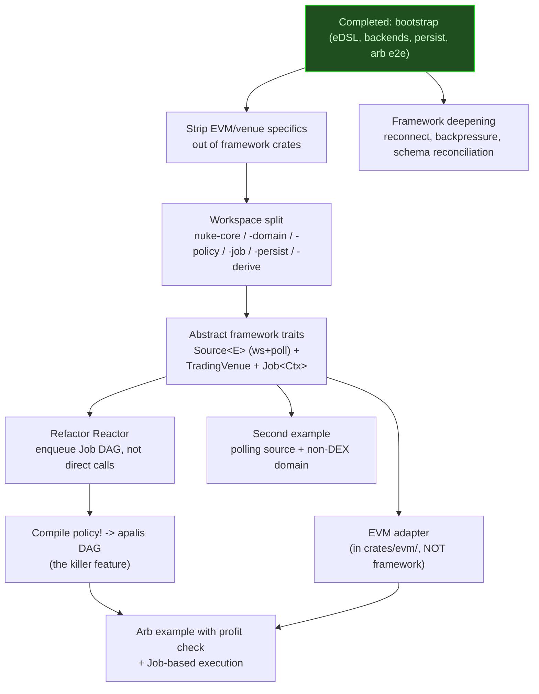

# nuke-rs Roadmap

What needs to happen to make nuke-rs a general-purpose event-driven framework
worth using. Epics are ordered by priority - the first epic is always the next
thing to implement.

See [CLAUDE.md](CLAUDE.md) for the architectural invariants this roadmap is in
service of, and [docs/architecture.md](docs/architecture.md) for the long-form
design.

## Dependency graph

Independent work streams (each suitable for its own worktree):

1. **Architecture stream**:
   `StripVenue -> WorkspaceSplit -> AbstractTraits -> ReactorRefactor -> PolicyToDag`
   (sequential).
2. **Adapter stream**: `EvmAdapter` (kicks off after `AbstractTraits`).
3. **Examples stream**: `ArbBotV2 -> SecondExample` (after the adapter + policy
   compiler).
4. **Hardening stream**: `FrameworkDeepening` (independent of the others).

## Strip EVM/venue specifics out of the framework crates

The framework currently has `EvmWsSource`, `nuke::evm`, alloy dependencies,
JSON-RPC framing, and a `#[derive(EvmSubject)]` macro all sitting in framework
code. Per [CLAUDE.md](CLAUDE.md), none of that belongs there.

- [ ] Inventory every reference to `evm`, `alloy`, `eth_subscribe`,
      `EvmWsSource`, `EvmSubject`, etc. in framework crates. Move each to either
      `examples/<name>/` (if it's example-specific) or `crates/evm/` (if it's a
      reusable adapter).
- [ ] Delete `nuke::evm` from framework code once everything is moved.
- [ ] Move `#[derive(EvmSubject)]` out of `nuke-derive`. The EVM derive belongs
      in an EVM-adapter proc-macro crate, not in the framework's derive crate.
- [ ] `Subject` becomes a fully abstract trait - keep it in the framework (it's
      the type-level subscription primitive) but drop any EVM-flavored
      docstrings.

## Workspace split

Convert the single `nuke` crate into a workspace. Layout:

| Crate                | Role                                                                     | Venue specifics? |
| -------------------- | ------------------------------------------------------------------------ | ---------------- |
| `nuke-core`          | `Source<E>`, `TradingVenue<...>`, run loop, type-level subject machinery | No               |
| `nuke-domain`        | `Symbol`, `Side`, `Px`, `Qty`, `Notional` over `Decimal`                 | No               |
| `nuke-policy`        | eDSL: `Expr<T>`, `RuleNode`, backends, policy -> DAG compiler            | No               |
| `nuke-job`           | `Job<Ctx>` trait + apalis adapter + `work::<Ctx, J>` handler             | No               |
| `nuke-persist`       | cqrs-es bridge                                                           | No               |
| `nuke-derive`        | Framework-only proc-macros (`#[derive(Domain)]`)                         | No               |
| `crates/evm/`        | EVM ws Source + signed-tx TradingVenue + `#[derive(EvmSubject)]`         | Yes              |
| `examples/dex_arb/`  | Cross-DEX arbitrage example                                              | Yes              |
| `examples/<second>/` | Polling-Source + non-DEX example                                         | Yes              |

- [ ] Set up the workspace `Cargo.toml`.
- [ ] Move modules to their target crates one at a time, keeping
      `cargo test --workspace` green at each step.
- [ ] Per-crate `README.md` files documenting role + composition.
- [ ] Module-level `//!` docs explaining each module's place in the architecture
      (per [CLAUDE.md](CLAUDE.md) workflow rules).

## Abstract framework traits

Replace concrete EVM types with the trait abstractions the framework should have
had from day one.

- [ ] `Source<E>` trait - produces a stream of typed events. Two adapter
      families:
  - [ ] **WebSocket adapter** - generic ws transport, reconnect, framing.
        Per-protocol decoders live in adapter crates.
  - [ ] **Polling adapter** - periodic typed fetcher; emits diffs / current
        state. Suitable for REST-only feeds.
- [ ] `TradingVenue<...>` trait (parameterized over the venue's order/fill/quote
      types) - outbound side. EVM (signed tx -> RPC), CEX REST, paper-trading
      sandbox are _implementations_.
- [ ] `Job<Ctx>` trait: `Serialize + DeserializeOwned + Send + 'static` with
      `label()` and `async fn perform(&self, ctx: &Ctx)`. Generic
      `work::<Ctx, J>` apalis handler with `backon` retries.
- [ ] Replace `EventSourced::Services` with the Ctx-injected Job pattern.
- [ ] Add `Validator` + `Processor<Event>` traits (small, generic, useful for
      audit trails).
- [ ] Add typed approve/refuse wrappers (`Approved<T>`, `Refused<T, Reason>`)
      for policy results.

## Refactor Reactor: enqueue Jobs, not direct calls

Currently `Reactor::react(event)` runs user code synchronously. Per the new
architecture, the reactor enqueues apalis Jobs that form a DAG workflow.
External-service side-effects always happen inside Jobs, never in the reactor
body.

- [ ] Replace `Reactor::react(event) -> Result<(), Error>` with a shape that
      emits a Job DAG.
- [ ] Wire reactor outputs through `apalis_workflow::DagFlow`.
- [ ] Update the in-memory `dequeue` runtime to handle DAG nodes.
- [ ] Document the failure modes (job rejected, retry exhausted, DAG step's
      predicate denied) and how they surface.

## Compile policy! eDSL -> apalis DAG

The framework's distinctive contribution. Walk a `RuleNode` and emit an
`apalis_workflow::DagFlow` ready for `WorkerBuilder::build`:

| AST node                        | DAG element                                      |
| ------------------------------- | ------------------------------------------------ |
| `Given { conditions, then }`    | predicate-gate node + edge to `then`             |
| `RejectIf { condition, ... }`   | predicate node + terminal Deny edge              |
| `EscalateIf { condition, ... }` | predicate node + terminal Escalate edge          |
| `All [a, b, c]`                 | sequential edges; first non-Allow short-circuits |
| `Any [a, b, c]`                 | sequential edges; first non-Allow short-circuits |
| `Bind { name, expr, then }`     | computed-step node, value flows downstream       |
| `execute SomeJob { ... }`       | apalis Job node                                  |

- [ ] Extend the `policy!` macro family with an `execute` form that embeds a
      `Job<Ctx>` impl as a leaf.
- [ ] Implement the AST -> DAG compilation as a 12th backend in
      `nuke-policy::backends`.
- [ ] Round-trip test: a policy compiles to a DAG, the DAG runs through apalis,
      the resulting verdicts match what the runtime evaluator backend would have
      produced.
- [ ] Switch the persistent backend story (per the persistence epic) so the
      compiled DAG can use `apalis-sql` once that's in.

## EVM adapter (in crates/evm/, NOT framework)

A reusable adapter crate that consumes the framework traits and provides
EVM-specific implementations for examples that want them.

- [ ] `crates/evm/` workspace member.
- [ ] EVM ws `Source<EthLog>` (the current `EvmWsSource` lives here).
- [ ] EVM `TradingVenue` impl that submits signed transactions via RPC.
- [ ] `#[derive(EvmSubject)]` proc-macro lives here.
- [ ] Examples that need EVM depend on this adapter, never on alloy directly.

## Arb example v2 - profit check + Job-based execution

The current arb example calls handlers directly and lacks a profitability gate.
v2:

- [ ] Use the EVM adapter from `crates/evm/` instead of in-tree `nuke::evm`.
- [ ] Add a `policy!` block that gates trade submission on profitability
      (`reject "arb.unprofitable" when expected_profit
      < min_threshold ...`).
- [ ] Trade submission becomes a `Job<Ctx>` impl (e.g.
      `SubmitArbTrade { buy_pool, sell_pool, size }`) executed via apalis with
      retries - never inline in the reactor.
- [ ] The e2e test asserts the policy correctly rejects below-threshold
      opportunities.

## Second example - polling source + non-DEX domain

Exercises a transport other than ws (polling) and proves the framework is
genuinely general-purpose by using a non-blockchain domain. Candidates:

- [ ] A scheduled rebalancer that polls a price feed via REST.
- [ ] A non-finance reactor (watch-this-API-for-a-condition agent).
- [ ] An IoT-ish sensor -> alert pipeline.

Pick when implementing; document why the choice covers a different gap from the
arb example.

## Framework deepening

The transports are intentionally minimal in v0. Filled in as real users push on
them:

- [ ] Reconnect with exponential backoff on the ws Source.
- [ ] Heartbeat / keepalive pings.
- [ ] Backpressure on the Source -> apalis pipe.
- [ ] Schema reconciler - refuse to start if a `Subject` / `EventSourced`
      `SCHEMA_VERSION` doesn't match what downstream consumers recorded.
- [ ] Persistent apalis backend (`apalis-sql`) so jobs survive restarts. Then
      enable the `apalis_workflow::DagFlow` chained reaction path.

## Documentation

Documentation is part of the work, not a cleanup pass. Updated in the same
commit as the code change per [CLAUDE.md](CLAUDE.md).

- [x] Repo `CLAUDE.md` with architectural invariants.
- [x] `docs/architecture.md` long-form architecture reference with diagrams.
- [x] README rewrite for the general-purpose framing.
- [ ] Per-crate `README.md` files after the workspace split.
- [ ] Module-level `//!` docs auditing pass once the abstract traits land.
- [ ] Worked-example doctest on the policy -> DAG compiler.

## Not epic

Smaller follow-ups not big enough to be their own epic yet:

- [ ] Real CI workflow for the SMT non-subsumption check (depends on eDSL SMT
      backend).
- [ ] `nuke::tracing::init` honors `NUKE_LOG` in addition to `RUST_LOG` for
      per-component filtering.
- [ ] Add `cleanup_finished_jobs` SQL helper (mirrors the conductor reference)
      when the persistent apalis backend lands.

## Completed: Bootstrap

- [x] Repo housekeeping (rename to `nuke`, drop template scaffolding).
- [x] Type-level core: `Subject`, `Subscribed`, `OneOf`, `HasSubject`,
      `subjects!` macro.
- [x] `Reactor` trait + `Arc<R>` blanket.
- [x] EVM ws transport - **to be moved to `crates/evm/`**.
- [x] `nuke-derive::EvmSubject` proc-macro derive - **to be moved to the EVM
      adapter crate**.
- [x] Apalis 1.x wired internally (`PipeExt::pipe_to` -> `dequeue::backend` ->
      `WorkerBuilder`).
- [x] `secretspec.toml` declares `ETH_WS_RPC_URL`.
- [x] DEX/DEX arb example.
- [x] E2e test against an embedded mock JSON-RPC ws server.
- [x] Replaced `f64` with `rust_decimal::Decimal` in arb math.

## Completed: eDSL foundation

- [x] Domain primitives (`nuke::domain`): `Symbol`, `Side`, `Px`, `Qty`,
      `Notional` over `Decimal` with typed `Qty * Px =
      Notional`.
- [x] eDSL typed AST: `Expr<T>` + `RuleNode` (initial encoding, no closures).
- [x] eDSL capability tracking: `Context` + `Capability` traits.
- [x] eDSL `Decision` algebra + `Reason` format-string AST + `Bindings` for
      evaluation capture.
- [x] `#[derive(Domain)]` proc-macro for typed field accessors.
- [x] `policy!` / `reject_when!` / `escalate_when!` / `all_of!` / `any_of!` /
      `given!` / `bind_as!` / `define_rule!` macros.
- [x] Rule registry: `register_rule!` via `linkme` distributed slice +
      uniqueness check.
- [x] eDSL runtime evaluator with bindings capture.

## Completed: eDSL backends (10 of 11; DAG compiler still TODO)

- [x] **1. Runtime evaluator** - see above.
- [x] **2. Markdown digest**.
- [x] **3. JSON Schema of required context**.
- [x] **4. Mermaid decision tree**.
- [x] **5. SMT export (Z3/CVC5 SMT-LIB).
- [x] **6. Proptest scaffolding** (TestPlan emission).
- [x] **7. SQL backtest** (`WHERE` clause compiler).
- [x] **8. Versioned wire format** (CBOR + SHA-256 schema hash).
- [x] **9. Semantic diff** (narrowed/widened/unrelated over RuleNode).
- [x] **10. Coverage / drift telemetry**.
- [x] **11. TLA+ predicate export**.
- [ ] **12. Policy -> apalis DAG compiler** - the killer feature. Lives in the
      "Compile policy! eDSL -> apalis DAG" epic above, not here.

## Completed: Persistence (cqrs-es bridge, soon to split into `event-sorcery` crate)

- [x] `nuke::persist::EventSourced` trait with rich associated types.
- [x] Naming asymmetry: `originate`/`evolve` (event-side) vs
      `initialize`/`transition` (command-side).
- [x] `Lifecycle<E>` adapter providing the blanket `cqrs_es::Aggregate` impl.
- [x] `LifecycleError<E>` enum covering structural + user errors.
- [x] `Never` uninhabited error type for infallible entities.
- [x] **Note:** `Services` will be replaced by the `Job<Ctx>` pattern under the
      "Abstract framework traits" epic.

## Completed: trybuild compile-fail tests

- [x] Two compile-fail cases proving non-exhaustive `.on(...).exhaustive()` and
      mismatched-typed comparisons fail to compile.
- [x] `#[ignore]`d by default (snapshots drift across rustc versions).

## Completed: Documentation

- [x] Repo `CLAUDE.md`.
- [x] `docs/architecture.md` with diagrams.
- [x] README rewrite for the general-purpose framing.
- [x] ROADMAP rewrite (this file) reflecting the new architecture.
