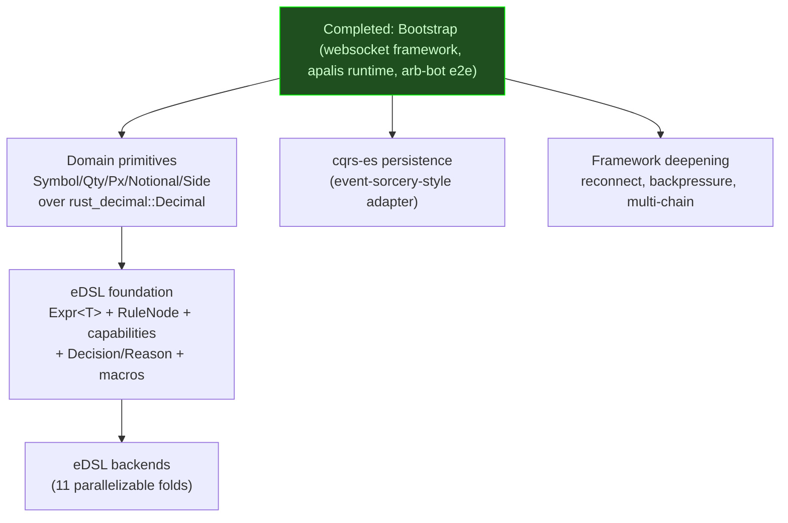
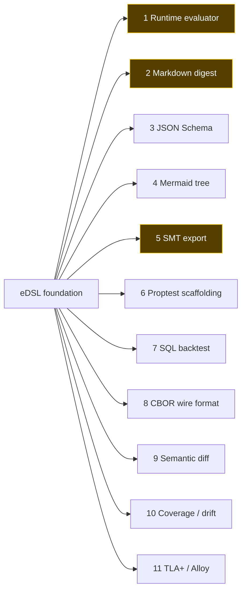

# nuke-rs Roadmap

What needs to happen to get nuke-rs from "first vertical slice that runs" to
"trading framework worth using." Epics are ordered by priority; the first
epic is always the next thing to implement.

## Dependency graph

Independent work streams (each suitable for its own worktree):
1. **eDSL stream**: `DomainPrimitives → eDSLFoundation → eDSLBackends` (sequential within, parallel backends after foundation lands).
2. **Persistence stream**: `cqrs-es adapter` (independent of eDSL, can start now).
3. **Framework stream**: reconnect/backpressure/multi-chain (independent of both).

## Domain primitives

Foundation for the eDSL and every backend that touches money or quantities.
Without these, the rest of the financial code drifts back to `f64` or stringly
typed amounts.

- [ ] Crate or module `nuke::domain` with newtypes:
  - [ ] `Symbol(SmolStr)` (or interned)
  - [ ] `Qty(Decimal)`
  - [ ] `Px(Decimal)`
  - [ ] `Notional(Decimal)`
  - [ ] `Side` (discriminated, `Buy | Sell`)
- [ ] `From`/`TryFrom` between primitives where the conversion is safe
  (e.g. `Qty * Px = Notional` is *not* free; build a typed multiplication
  helper that returns `Notional`).
- [ ] No `f64` anywhere in domain code (CI lint).
- [ ] Conversions from EVM types (`U256`, `U112`) into the appropriate
  domain primitive at the decode boundary — never let raw integers leak past
  the websocket / decoder layer.
- [ ] Audit current `examples/arb_bot/main.rs` and `tests/arb_bot_e2e.rs` to
  use the new primitives instead of bare `Decimal`.

## eDSL foundation

The typed AST + capability machinery + macros that everything else folds
over. Habito-style: stakeholders read it, type system rejects insufficient
contexts, no closures anywhere in the rule language.

- [ ] `nuke::policy::ast` — the reified AST.
  - [ ] `Expr<T>` polymorphic typed expression node (phantom `T` for
    compile-time value-type checks).
  - [ ] Inner `Expr` enum uniformly enumerated (so backends walk without
    generics): `Lit`, `Field`, `BinOp`, `Cmp`, `Call`, `Bind`, `Cond`, etc.
  - [ ] `RuleNode` for control flow: `Given`, `RejectIf`, `EscalateIf`,
    `All`, `Any`, `Bind`.
  - [ ] Initial encoding (NOT tagless-final).
- [ ] Capability tracking.
  - [ ] Capability traits per readable thing: `HasOrder`, `HasInventory`,
    `HasMarketData`, `HasRiskLimits` (extend as features need).
  - [ ] `Rule<Caps>` carrying phantom type-level capability list (reuse
    `Cons`/`Nil` from `nuke::subscribed`).
  - [ ] `Provides<Caps>` trait proving a context satisfies the list.
  - [ ] HList-shaped `ProvidesAll` (or sorted normalization) so capability
    tuples are order-independent.
  - [ ] Wiring rule against insufficient context = compile error (proven
    via trybuild test).
- [ ] `Decision` algebra:
  - [ ] `Allow | Deny { rule, reason, bindings } | Escalate { rule, to,
    reason }`.
  - [ ] `bindings` carries the actual values that produced the verdict
    (captured during evaluation), making rejections self-explanatory and
    reproducible.
- [ ] `Reason` is a format-string AST with named slots, NOT `String`.
  Preserves structure for every backend.
- [ ] `nuke-derive::Domain` proc-macro on each domain struct.
  - [ ] Generates typed field accessors (`order::qty()`, `order::side()`).
  - [ ] Registers metadata (display names, units, types) into a startup
    global registry every backend reads from. Likely `linkme`-distributed.
- [ ] `policy!` macro — writing surface that desugars to AST constructors.
  - [ ] Syntactically rejects free-form Rust blocks.
  - [ ] Emits zero closures at the leaves — every leaf is a typed AST node.
- [ ] Rule ID interning + uniqueness.
  - [ ] Interned `&'static str` IDs registered via `linkme`-distributed
    slice.
  - [ ] CI script enforces uniqueness AND a corresponding markdown entry
    per ID.

## eDSL backends

Each backend is a fold over `RuleNode` (sometimes also `Expr`). After the
foundation lands they're parallelizable; the build order below is *priority*
(value to the project), not strict dependency order.

- [ ] **1. Runtime evaluator** — macro-generated, monomorphic per rule,
  branch-predictable; populates `bindings` on the deny path. Highest
  priority — without this nothing actually runs.
- [ ] **2. Markdown digest** — what compliance signs off on; field paths
  render via the name registry. Diffs become free changelogs.
- [ ] **3. JSON Schema of required context** — minimal contract for any
  system feeding the rule.
- [ ] **4. Mermaid decision tree** — visual review; catches dead branches.
- [ ] **5. SMT export (Z3/CVC5)** — proves totality and non-subsumption (no
  rule fully shadowed by another) in CI.
- [ ] **6. Proptest scaffolding** — strategies derived from branch
  structure; coverage is structural, not line-based.
- [ ] **7. SQL backtest** — compile predicates to a `WHERE` clause; run
  against historical flow to measure hit-rate and trader impact before
  deploying.
- [ ] **8. Versioned wire format (CBOR + schema hash)** — post-trade audit
  references the exact rule that ran. Enables hot-reload.
- [ ] **9. Semantic diff** over `RuleNode` — narrowed / widened / unrelated;
  far better than textual git diff for review.
- [ ] **10. Coverage / drift telemetry** — log which leaves fire in
  production; surface dead rules and regime changes.
- [ ] **11. TLA+ / Alloy export** — when the policy is one component of a
  larger order-lifecycle state machine.

## Persistence (cqrs-es, event-sorcery-style adapter)

Long-lived state is event-sourced via cqrs-es with a custom adapter modeled
on `~/code/st0x/st0x.liquidity/crates/event-sorcery/`. Avoids cqrs-es's
sharp edges (infallible `apply`, stringly aggregate IDs, no schema
versioning, flat command handling).

- [ ] `nuke::persist::EventSourced` trait with rich associated types
  (`Id`, `Event`, `Command`, `Error`, `Services`, `Materialized`) and
  consts (`AGGREGATE_TYPE`, `PROJECTION`, `SCHEMA_VERSION`).
- [ ] Naming asymmetry: `originate`/`evolve` (event-side) vs
  `initialize`/`transition` (command-side).
- [ ] Strongly-typed aggregate IDs (newtype around the natural identifier
  for each aggregate type).
- [ ] Internal `Lifecycle`-equivalent providing the blanket
  `cqrs_es::Aggregate` impl; users only see nuke's trait.
- [ ] Names deliberately distinct from cqrs-es so it's obvious which crate
  owns a symbol.
- [ ] Schema reconciler — startup-time check that bumps reconcile stale
  snapshots/views automatically.
- [ ] Reuse `Cons`/`Nil`/`OneOf` machinery for multi-aggregate reactors.
- [ ] When this lands, switch the apalis adapter from the in-memory
  `dequeue` backend to a persistent backend (`apalis-sql` or similar) so
  reactor jobs survive restarts. Then enable the `apalis-workflow` chained
  reaction path.

## Framework deepening

The websocket transport is intentionally minimal in v0. As real users push
on it, fill in:

- [ ] Reconnect with exponential backoff (currently a single ws connection
  with no recovery).
- [ ] Heartbeat / keepalive pings.
- [ ] Backpressure on the EvmWsSource → apalis pipe.
- [ ] Reorg handling (slot-aware deduplication of logs that get reverted).
- [ ] Multi-chain support (currently Ethereum mainnet only).
- [ ] More DEX adapters (Uniswap V3, Curve, Balancer; Subject types for
  each).
- [ ] CEX adapters (Binance, Coinbase, Bybit) — same `Subject` shape, ws
  decoder per venue.
- [ ] ABI schema reconciler — refuse to start if a `Subject::SCHEMA_VERSION`
  doesn't match what downstream consumers recorded.

## Not epic

Smaller follow-ups not big enough to be their own epic yet:

- [ ] `trybuild` compile-fail tests for the type-level invariants on
  `OneOf`/`subjects!` (proves non-exhaustive `react` chain fails to
  compile, and proves capability mismatch is a compile error once the eDSL
  lands).
- [ ] Real CI workflow for the SMT non-subsumption check (depends on eDSL
  SMT backend).
- [ ] `nuke::tracing::init` honors `NUKE_LOG` in addition to `RUST_LOG` for
  per-component filtering.

## Completed: Bootstrap

The websocket framework + apalis-backed runtime + DEX/DEX arb-bot example +
e2e test against an embedded mock JSON-RPC ws server.

- [x] Repo housekeeping: rename to `nuke`, drop the `rust-nix` template
  scaffolding (`src/main.rs`, `templates/`, `ci-template-mirror`).
- [x] Type-level core: `Subject`, `Subscribed`, `OneOf`, `HasSubject`,
  `subjects!` macro — mirrors event-sorcery's `Cons`/`Nil`/`OneOf`/`deps!`
  pattern.
- [x] `Reactor` trait + `Arc<R>` blanket.
- [x] `EvmWsSource`: ws transport + JSON-RPC framing + `eth_subscribe`
  management.
- [x] `nuke-derive::EvmSubject` proc-macro derive.
- [x] Apalis 1.x wired internally as the run loop (`PipeExt::pipe_to` →
  `dequeue::backend` → `WorkerBuilder`). Public API never exposes apalis.
- [x] `secretspec.toml` declares `ETH_WS_RPC_URL`; example loads via
  `secretspec_derive::declare_secrets!`.
- [x] DEX/DEX arb example (Uniswap V2 vs SushiSwap V2 on WETH/USDC).
- [x] E2e test against an embedded mock JSON-RPC ws server with a
  deterministic fixture.
- [x] Replaced `f64` with `rust_decimal::Decimal` in arb math (no `f64` in
  domain code).
