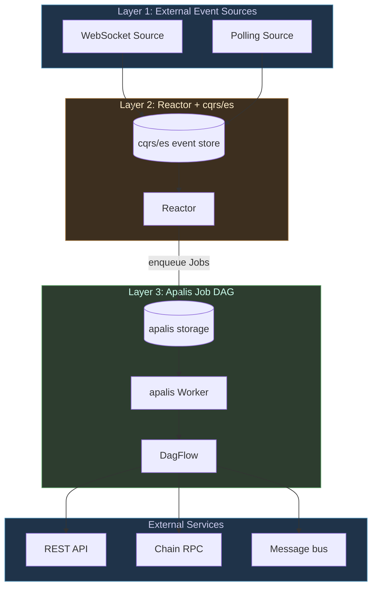

# nuke-rs Architecture

The framework's job is to compose three things that have always been hard to
wire together cleanly:

1. **External event sources** that run forever (websocket subscriptions, polling
   adapters).
2. **Domain logic** that decides what to do when events land.
3. **Side-effects** that actually go talk to the outside world (POST requests,
   signed transactions, message sends), and that must be durable, retryable, and
   observable.

Each layer has been written separately many times. nuke-rs is the opinionated
glue that picks the best-of-breed library for each layer (apalis for jobs,
cqrs-es for state, the eDSL for declarative policy) and composes them under one
user-facing surface.

## The three layers



### Layer 1 — Sources

A `Source<E>` produces a stream of typed events `E`. Two adapter families ship
with the framework:

- **WebSocket Source** — handles ws transport, reconnect, framing. The transport
  is generic; per-protocol decoders (e.g. JSON-RPC `eth_subscribe`) live in
  adapter crates that consume the framework.
- **Polling Source** — periodically calls a typed fetcher and emits the diffs /
  current state. Suitable for REST-only feeds.

Sources are **transport adapters**, not venue adapters. There is no "EVM source"
in the framework — there's a JSON-RPC ws transport (in the EVM adapter crate)
that produces a typed `Source<EthLog>`.

### Layer 2 — Reactor + cqrs/es

Events from sources flow into a cqrs/es event store (`nuke-persist`). Reactors
consume events (both directly streamed and replayed from the store) and
**enqueue apalis jobs forming a DAG workflow**.

The reactor itself does no I/O. Its job is:

1. Fold events into typed decisions.
2. Hand those decisions off as job specs to apalis.

That separation is what makes durability free — jobs survive restarts, retry on
transient failures, and report status back through apalis's lifecycle.

### Layer 3 — Apalis Job DAG

Every external-service interaction is a `Job<Ctx>`. The trait, modeled on
[`~/code/st0x/st0x.liquidity/src/conductor/job.rs`](../README.md):

```rust
pub trait Job<Ctx>: Serialize + DeserializeOwned + Send + 'static
where Ctx: Send + Sync + 'static
{
    type Error: std::error::Error + Send + Sync + 'static;
    fn label(&self) -> Label;
    async fn perform(&self, ctx: &Ctx) -> Result<(), Self::Error>;
}
```

Apalis stores the job (CBOR / SQL / Redis depending on backend), hands it to a
worker, and applies an exponential retry policy via `backon`. Multi-step
workflows compose via `apalis_workflow::DagFlow` — the framework wires this for
you when a policy compiles.

## The eDSL → DAG compilation path

This is the framework's distinctive contribution. A `policy!` block:

```rust
policy! {
    given [order::side() == Side::Buy.into(), order::price() > Px::lit(...)]
    then all [
        reject "orders.over_exposure"
            when account::exposure() > risk::max_exposure(),
            because "exposure cap exceeded",

        reject "orders.unprofitable"
            when expected_profit < min_profit_threshold,
            because "edge below minimum",

        // Only reaches here if every reject_when above passed:
        execute SubmitOrder { ... },
    ]
}
```

…compiles into a DAG where:

| AST node                        | DAG element                                      |
| ------------------------------- | ------------------------------------------------ |
| `Given { conditions, then }`    | predicate-gate node + edge to `then`             |
| `RejectIf { condition, ... }`   | predicate node + terminal Deny edge              |
| `EscalateIf { condition, ... }` | predicate node + terminal Escalate edge          |
| `All [a, b, c]`                 | sequential edges; first non-Allow short-circuits |
| `Any [a, b, c]`                 | sequential edges; first non-Allow short-circuits |
| `Bind { name, expr, then }`     | computed-step node, value flows downstream       |
| `execute SomeJob { ... }`       | apalis Job node                                  |

The compiled DAG is ready to feed `WorkerBuilder::build`. Backends that walk the
same AST (markdown, mermaid, SMT, SQL, ...) see the same structure — each is a
fold over `RuleNode`.

## Hard invariants

Captured in [`CLAUDE.md`](../CLAUDE.md). The big ones:

- No `f64` in domain code. `rust_decimal::Decimal` everywhere, behind newtypes
  (`Px`, `Qty`, `Notional`, ...).
- No closures in the eDSL.
- No venue specifics (`alloy`, exchange clients, etc.) in framework crates.
  EVM/SVM/CEX live in `examples/*` and `adapters/*` only.
- External-service side-effects only inside `Job<Ctx>` impls.
- Apalis is internal — the public API stays in nuke vocab.

## Comparison with peer frameworks

- **`barter-rs`** (`~/code/0xgleb/barter-rs/`) — barter has `AlgoStrategy` →
  `RiskManager` → execution. nuke-rs collapses Strategy + Risk into a single
  declarative `policy!` block that compiles to a DAG. barter is more opinionated
  about market data (the `Subscription`/`MarketStream` machinery); nuke-rs is
  more opinionated about composition (cqrs/es + apalis DAGs).
- **event-sorcery** (`~/code/st0x/st0x.liquidity/crates/event-sorcery/`) — the
  pattern nuke's `nuke-persist` mirrors: rich-typed `EventSourced` trait +
  internal `Lifecycle` adapter to cqrs-es. Same naming asymmetry
  (`originate`/`evolve` event-side, `initialize`/`transition` command-side).
- **conductor/job.rs** (`~/code/st0x/st0x.liquidity/src/conductor/job.rs`) — the
  canonical `Job<Ctx>` pattern nuke's `nuke-job` mirrors. Generic
  `work::<Ctx, J>` apalis handler with `backon` retries.

## Where this design comes from

The user named the project around the metaphor: a **nuclear reactor** that
reacts to events and triggers chain reactions (jobs, downstream reactions). The
reactor metaphor is load-bearing — each piece of the architecture maps onto it:

- **Source** = the reactor's neutron flux (incoming particles).
- **Reactor** = the core (deciding what reactions fire).
- **Job DAG** = the chain reaction (downstream cascade).
- **Policy** = the moderator + control rods (the rules that decide which
  reactions are allowed and which are damped).

When in doubt about a design call, the metaphor usually says which way to lean.
